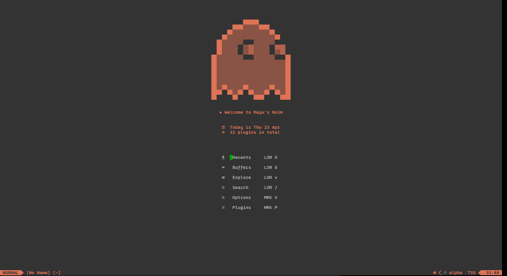

# 🎮 Neovim Configuration



# nvim config

A Neovim setup with AI assistance, LSP support, and a clean UI.


---

## Requirements

- Neovim 0.9+
- Git
- Node.js
- Python
- ripgrep (optional, for live grep)

---

## Install

```bash
# Backup existing config
mv ~/.config/nvim ~/.config/nvim.backup

# Clone
git clone https://github.com/yourusername/neovim-config.git ~/.config/nvim

# Open Neovim — plugins install automatically
nvim

# Authenticate Copilot
:Copilot auth
```

---

## Structure

```text
nvim/
├── init.lua
├── KEYBINDINGS.md
├── README.md
├── lazy-lock.json
├── assets/
│   └── dashboard.png
└── lua/
	├── config/
	│   ├── jii.lua
	│   ├── options.lua
	│   ├── shortcuts.lua
	│   ├── spelling.lua
	│   └── txt.lua
	└── plugins/
		├── alpha.lua
		├── auto-session.lua
		├── blink.lua
		├── bufferline.lua
		├── colorscheme.lua
		├── compititest.lua
		├── complition.lua
		├── copilot-chat.lua
		├── copilot.lua
		├── editor.lua
		├── extras.lua
		├── format.lua
		├── gitsigns.lua
		├── icons.lua
		├── keymaps.lua
		├── line-counter.lua
		├── lsp.lua
		├── lualine.lua
		├── navigation.lua
		├── noice.lua
		├── notify.lua
		├── nvim-tree.lua
		├── presence.lua
		├── telescope.lua
		├── tree-sitter.lua
		├── ui.lua
		└── winbar.lua
```

---

## Key Bindings

| Action | Key |
|--------|-----|
| Save | `<leader>w` |
| Quit | `<leader>q` |
| File explorer | `<leader>e` |
| Find files | `<leader>ff` |
| Live grep | `<leader>fg` |
| Recent files | `<leader>h` |
| Search buffers | `<leader>b` |
| Next buffer | `Tab` |
| Prev buffer | `Shift+Tab` |
| Close buffer | `<leader>c` |
| Go to definition | `gd` |
| Hover docs | `K` |

### Copilot

| Action | Key |
|--------|-----|
| Open chat | `<leader>aa` |
| Quick ask | `<leader>aq` |
| Explain code | `<leader>ae` |
| Review code | `<leader>ar` |
| Fix code | `<leader>af` |
| Optimize | `<leader>ao` |
| Generate docs | `<leader>ad` |
| Generate tests | `<leader>at` |
| Fix diagnostics | `<leader>aD` |
| Generate commit | `<leader>ac` |
| Clear chat | `<leader>ax` |

### Copilot suggestions (insert mode)

| Action | Key |
|--------|-----|
| Accept | `Ctrl+y` |
| Next | `Ctrl+]` |
| Previous | `Ctrl+[` |
| Dismiss | `Ctrl+e` |

---

## Plugins

- **lazy.nvim** — plugin manager
- **telescope.nvim** — fuzzy finder
- **nvim-lspconfig + mason** — language servers (Lua, Python, TS/JS)
- **nvim-cmp** — autocompletion
- **copilot.lua + CopilotChat.nvim** — AI suggestions and chat
- **neo-tree** — file explorer
- **lualine** — status bar
- **bufferline** — buffer tabs
- **gitsigns** — git indicators
- **treesitter** — syntax highlighting
- **alpha.nvim** — dashboard
- **noice.nvim** — command line UI
- **nvim-autopairs** — bracket auto-close
- **Comment.nvim** — comment toggle
- **presence.nvim** — Discord presence

---

## Customization

**Theme** — edit `lua/plugins/colorscheme.lua`:
```lua
require("catppuccin").setup({ flavour = "mocha" })
-- mocha | macchiato | frappe | latte
```

**Add LSP servers** — edit `lua/plugins/lsp.lua`:
```lua
servers = { "gopls", "rust_analyzer", "clangd" }
```

**Leader key** — edit `lua/config/options.lua`:
```lua
vim.g.mapleader = " "
```

---

## Troubleshooting

| Problem | Fix |
|---------|-----|
| Copilot not working | `:Copilot auth` |
| LSP not starting | `:LspInfo`, then `:MasonInstall <server>` |
| `rg` not found | Install ripgrep |
| Icons broken | Install a Nerd Font and set it in your terminal |
| Plugins broken | Delete `~/.local/share/nvim` and reopen Neovim |

---

## Update

```vim
:Lazy update
```